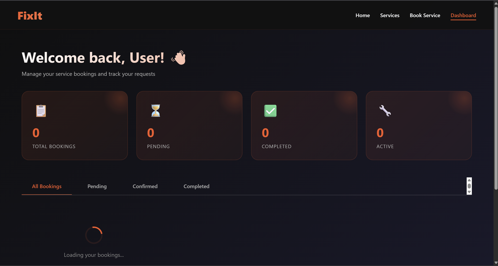

# Fixit

Fixit is a modern home repair and maintenance service website that makes it easy for users to discover, compare, and book local service professionals. Designed with a clean UI and smooth browsing experience, Fixit turns everyday household problems into quick and reliable solutions.


---

The platform combines a premium frontend experience with a functional Django backend, including user authentication, booking management, and a personalized dashboard.

---

# 🚀 Project Overview

Fixit transforms everyday household problems into quick, reliable solutions by connecting users with service professionals across multiple categories like plumbing, electrical work, cleaning, pest control, renovation, wellness, and more.

The platform features:

A visually rich, responsive frontend

A booking system connected to a Django backend

A user dashboard to track bookings and service status

---

# ✨ Key Features

# 🎨 Frontend

Modern & Responsive UI – Optimized for desktop, tablet, and mobile

Glassmorphism & Gradient Design – Premium dark theme with smooth animations

Multi-Page Website

Home

Services (30+ service pages)

Booking

Login / Signup

Dashboard

About & Contact

Interactive Dashboard

Total bookings

Pending, Active & Completed services

Booking status tracking

Smooth Animations & Hover Effects

Clean & Organized Codebase (HTML, CSS, JavaScript)

# ⚙️ Backend (Django)

Django Backend Architecture

REST-style API for bookings

SQLite database

API endpoints for:

Creating bookings

Fetching user bookings

Dashboard data integration

Structured Django app with:

models.py

views.py

urls.py

admin.py

---


## 🗂️ Project Structure

```

Fixit/
├── assets/                         # Images, icons & UI assets
│
├── backend/                        # Django backend
│   └── fixit_backend/
│       ├── api/                    # Booking & dashboard APIs
│       │   ├── migrations/
│       │   ├── __init__.py
│       │   ├── admin.py
│       │   ├── apps.py
│       │   ├── models.py
│       │   ├── tests.py
│       │   ├── urls.py
│       │   └── views.py
│       │
│       ├── fixit_backend/          # Django project settings
│       │   ├── __init__.py
│       │   ├── asgi.py
│       │   ├── settings.py
│       │   ├── urls.py
│       │   └── wsgi.py
│       │
│       ├── db.sqlite3              # Database
│       └── manage.py
│
├── js/                             # Frontend JavaScript
│   ├── booking.js
│   ├── dashboard.js
│   └── script.js
│
├── services/                       # Individual service pages   
│   ├── plumbing.html
│   ├── electrical.html
│   ├── cleaning.html
│   ├── pestcontrol.html
│   ├── renovation.html
│   ├── wellness.html
│   └── ... (30+ service pages)
│
├── index.html                      # Home page
├── booking.html                    # Service booking page
├── dashboard.html                  # User dashboard
├── login.html                      # Login page
├── signup.html                     # Signup page
├── about.html                      # About page
├── contact.html                    # Contact page
├── style.css                       # Global styles
└── README.md                       # Project documentation
```

# Main FIXIT Services Visuals (8*4)


---

# 🧠 Tech Stack

# Frontend

HTML5

CSS3

JavaScript (Vanilla JS)

# Backend

Python

Django

SQLite

---

# 📊 Dashboard Functionality

Fetches booking data from backend APIs

Displays:

     Total bookings

     Pending bookings

     Active services

     Completed services

Dynamic UI updates using JavaScript
    
Secure flow connected with backend login system

# dashboard user (If my FIXIT is in real world )




---

# 🎯 Purpose of This Project

Showcase frontend UI/UX skills

Practice real-world backend integration

Build a full-stack booking system

Portfolio-ready project for internships & placements

# 🎨 Media Attribution

This project uses AI-generated visuals. All images and graphics were created using Gemini AI, specifically for Fixit. No third‑party downloaded assets are used.


---

# 📞 Contact & Links

If you liked this project or want to collaborate, feel free to connect 👇

📧 Email:
srivastavarohitkumar067@gmail.com

🔗 LinkedIn:
https://www.linkedin.com/in/rohit-kumar-srivastava-39a74b372

🐦 Twitter (X):
https://x.com/itsrohit_tech

---

# ⭐ Support

If you like this project, don’t forget to star ⭐ the repository and share feedback!